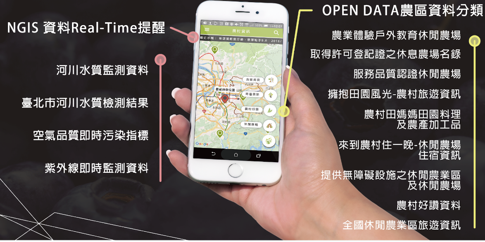
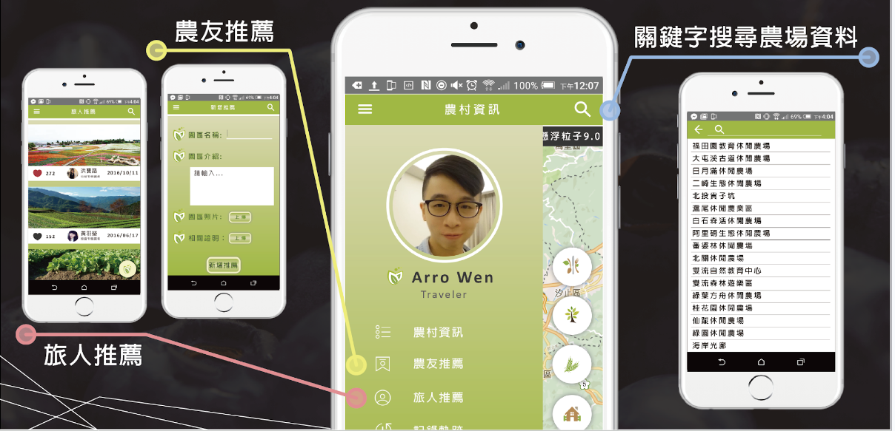

# Arig Food

在台灣因食安問題層出不窮，因此此App透過政府提供之Open Data，提供使用者有關政府認證食安資訊

# App功能
 - Open Data 之應用
   

 - 旅人推薦,農有推薦,關鍵字查找
   

# 開發工具與程式語言

- Android Studio
- Java

# 運用技術

- OAuth 2.0 :Google MAP APIs 

# 影片操作

- 基本操作

   

# 備註

- 此App 為 [2016第21屆全國大專校院資訊應用服務創新競賽](https://bhuntr.com/tw/competitions/competitionalias4760071463555654) 的DEMO
- 於2016創建，因為年久失修，會與當前Android 版本不相容
- Google OAuth 2.0 相關服務之金鑰已失效
- 本需搭配.NET WEB 一起應用，但該程式因為更換實驗室Window Service時忘記備份